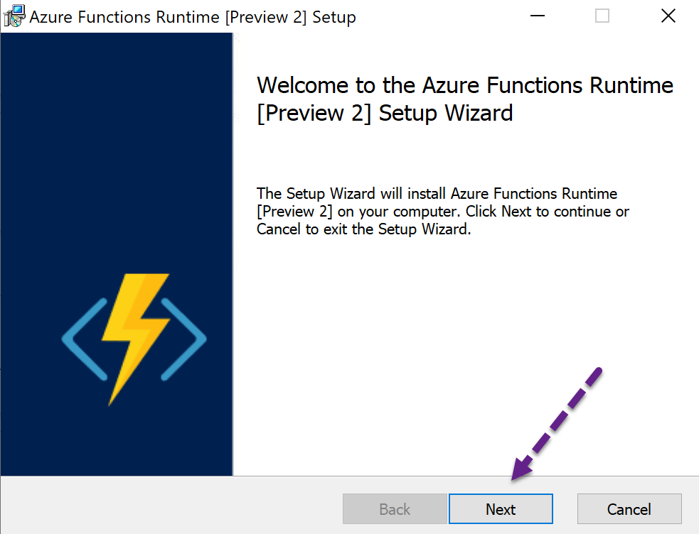
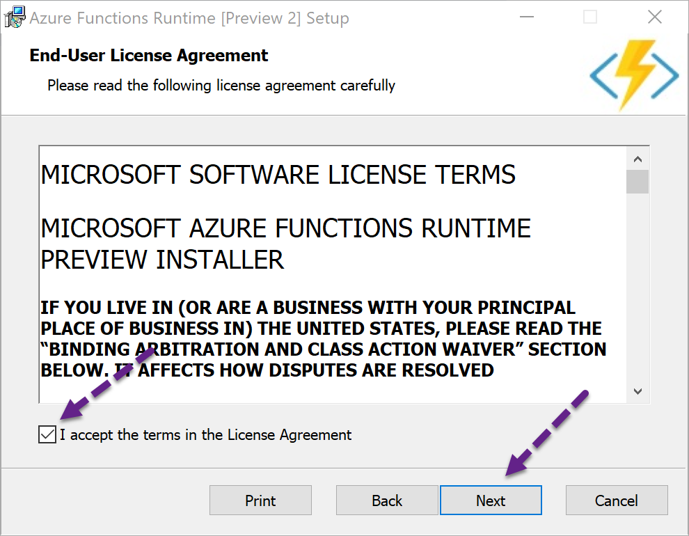
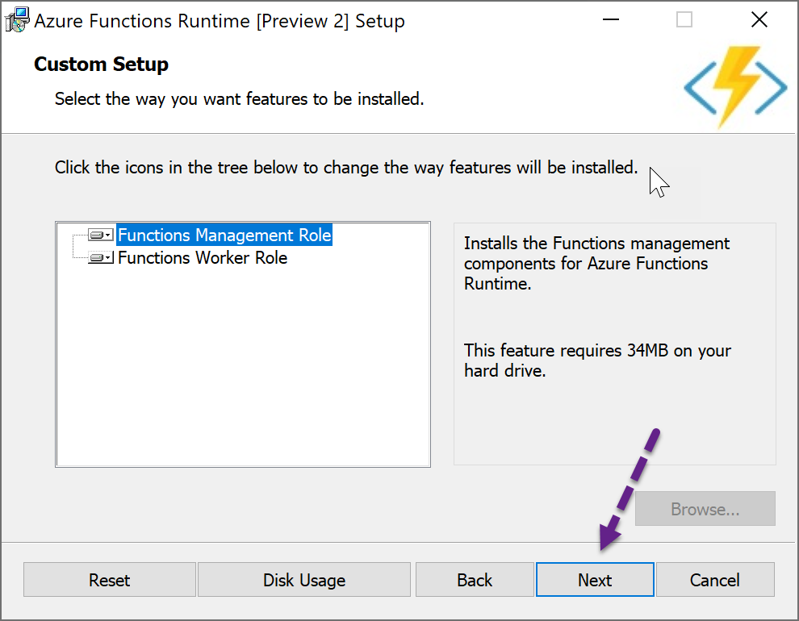
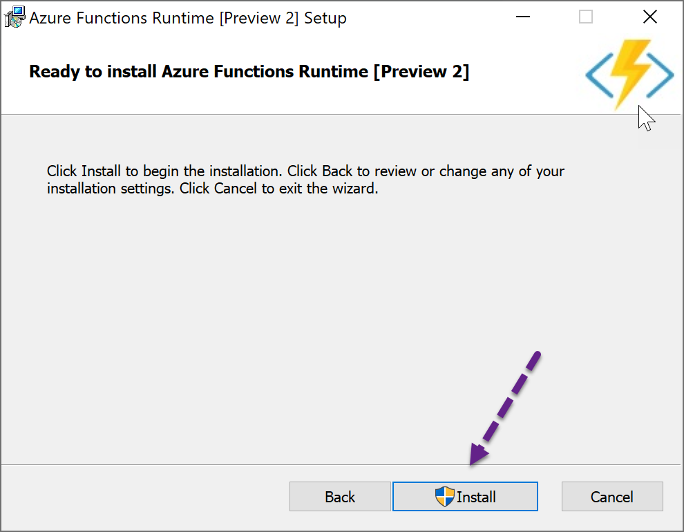
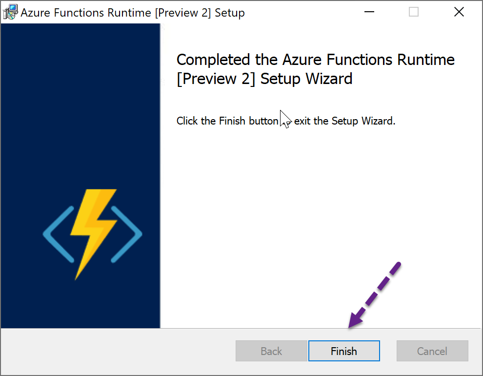

# Before you start
- Windows 10 Creator or better
- SQL Express local or local network SQL
- Download [Azure Runtime Installer](https://aka.ms/azafrv2)

# Running the Installer

We will use SQL Express for this session
This is basically a click Next exercise.

Accept the License Agreement

